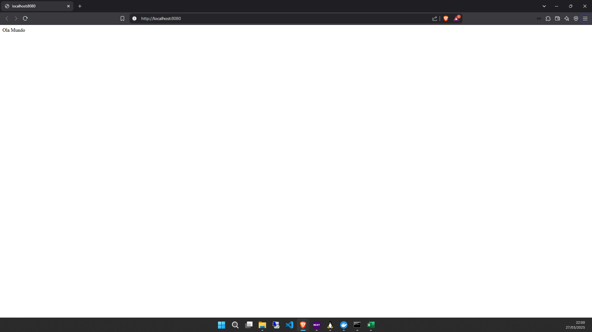
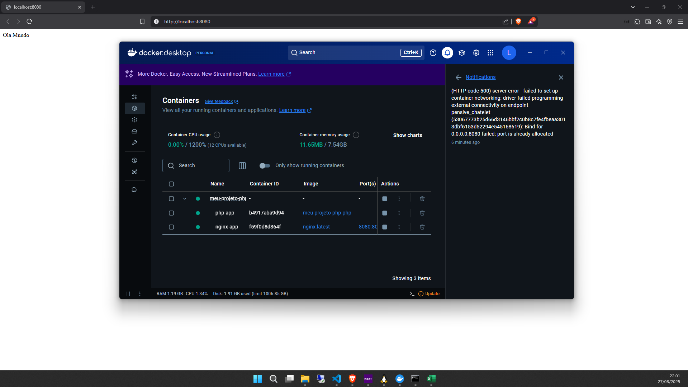

# Criação da imagem Docker

Foi utilizado um arquivo `Dockerfile` para criar uma imagem personalizada do PHP-FPM, contendo as extensões necessárias (`pdo_mysql`, `mbstring`), e configurando permissões adequadas para a aplicação.

# Separação em dois containers com Docker Compose

Utilizamos o **Docker Compose** para separar claramente os serviços em dois containers distintos:

- **PHP-FPM**: responsável por interpretar o código PHP.
- **Nginx**: responsável por servir os arquivos estáticos e encaminhar requisições PHP ao container do PHP-FPM.

# Volumes Docker

Foram utilizados volumes para sincronizar o diretório local (`./src`) com o diretório interno dos containers (`/var/www/html`). Isso permite persistir e alterar os arquivos da aplicação sem precisar reconstruir os containers.

# Build e execução

Para criar e executar os containers, rodamos os comandos abaixo no terminal:

```bash
docker compose build
docker compose up -d
```

# Teste final
A aplicação foi testada acessando o navegador através do endereço:

```
http://localhost:8080
```

Com isso, foi validado que o **Nginx** conseguiu corretamente comunicar-se com o **PHP-FPM**, executando e exibindo o conteúdo do arquivo `index.php`.

# Imagens dos testes


